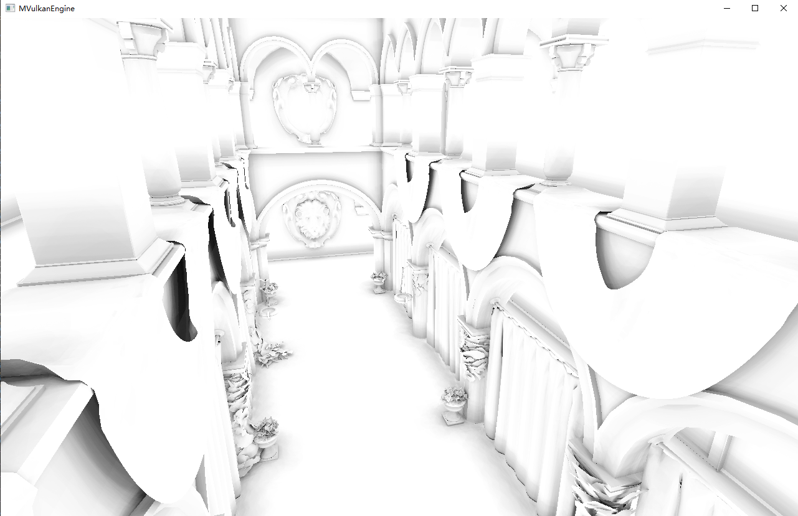

# MVulkanEngine

## TODO List  
1.culling  
2.gui
3.ssao
4.GI

Current Function:  
pbr:  
use PCF as soft shadow

ibl:

ssr:
version1.0, based on pbr, use 3-step ray-marching to find reflection ray's intersection point.

rtao:
ray tracing ambient occlusion
